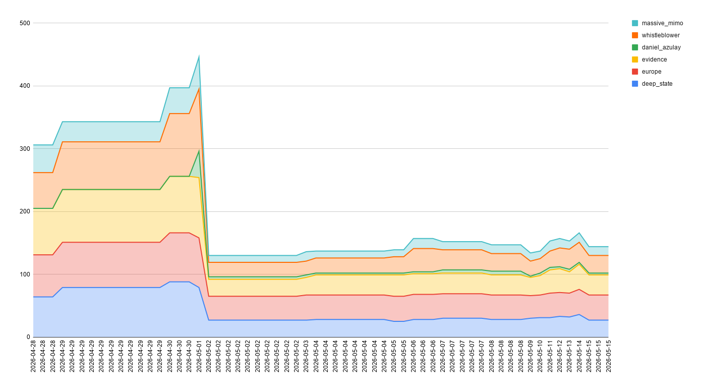

# GTRENDS-MAYDAY - Algorithmic Pruning Detection & Forensic Screenshot Collection Tool


## Description

Automated headless browser tool for systematic Google Trends screenshot collection across semantic gradients, specifically designed to test the algorithmic pruning hypothesis following the April 29, 2026 whistleblower disclosure to the Defense Intelligence Agency. Generates structured screenshot datasets compatible with GTRENDS-OCR for time-series extraction and statistical decomposition of search trend anomalies.

**This project supports independent forensic research into platform-level query suppression mechanisms.**

### Research Background

Following a whistleblower call to the Defense Intelligence Agency on April 29, 2026, alleging NATO involvement in "Havana syndrome" through a 5G-integrated directed-energy mechanism, platform-level pruning mechanisms appear to have been rapidly deployed on May 1, 2026—strategically implemented before the weekend and the start of the new month—to suppress search visibility for semantically proximate terms.



This tool enables systematic collection of search trend data to test the pruning hypothesis using linear compositional decomposition:

$$T_{AB}(t) \approx \alpha T_A(t) + \beta T_B(t) + \epsilon(t)$$

Where:
- $T_{AB}(t)$ = Combined phrase search index
- $T_A(t), T_B(t)$ = Component term indices  
- $\alpha, \beta$ = Pruning/amplification weights
- $\epsilon(t)$ = Residual variance (noise, privacy injection, aliasing, event leakage)

Pruning is inferred when $\alpha \ll 1$ or $\beta \ll 1$ (asymmetric term suppression). Invalid weights ($\alpha, \beta \notin [0,1]$) suggest amplification or non-compositional behavior requiring bounded-weight modeling.

### Usage

```bash
# Install dependencies
npm install

# Run the scraper with default configuration
npm start

# Or run directly
node index.js
```

### Prerequisites

```bash
# Install Tesseract OCR for screenshot analysis
# macOS:
brew install tesseract

# Ubuntu/Debian:
sudo apt-get install tesseract-ocr

# Verify installation
tesseract --version
```

### Configuration Files

**keywords.json** - Semantic gradient of term triplets spanning RF, 5G, metamaterials, diplomatic nodes, and medical terminology:

```json
[
  "directed energy weapon",
  "high power microwave",
  "rf jamming array",
  "millimeter wave cannon",
  "pulsed power system",
  "active denial system",
  "microwave auditory effect",
  "neural interference weapon",
  "massive mimo panel",
  // ... 1000+ term triplets
]
```

**user-agents.json** - Browser user agents for rotation to avoid detection patterns:

```json
[
  "Mozilla/5.0 (Windows NT 10.0; Win64; x64) AppleWebKit/537.36 Chrome/120.0.0.0 Safari/537.36",
  "Mozilla/5.0 (Macintosh; Intel Mac OS X 10_15_7) AppleWebKit/537.36 Chrome/119.0.0.0 Safari/537.36"
  // ... 99+ user agents
]
```

### General Workflow

```
maskirovka@3301 % npm start

=== Google Trends Scraper with OCR Analysis ===

✓ Tesseract OCR found
Loaded 1082 compound keywords from ./keywords.json
Loaded 99 user agents from ./user-agents.json
Output directory ready: ./output

=== Initializing clean Google Trends session ===
  Clearing ALL browser storage...
    Deleted 0 cookies
    Cleared browser cache and remaining cookies
    Cleared localStorage and sessionStorage
  Re-initializing Google Trends session...
  Session re-initialized successfully
✓ Clean session ready

=== Generating all search terms from compound keywords ===
  Generated 6600 total search terms from 1082 compound keywords

📊 Generated 6600 unique search terms total.
🔀 Randomized the order of 6600 search terms.

=== Processing search terms in randomized order ===

[1/6600] Processing term: "microwave hearing effect"
Navigating to: https://trends.google.com/trends/explore...
Screenshot saved: output/microwave_hearing_effect_05-17-2026_18-45-45_pending_200.jpg
  Analyzing screenshot with OCR...
  Pattern detected: success (chart data found)
  Renamed to: microwave_hearing_effect_05-17-2026_18-45-45_success_200.jpg
  ✓ Success! Chart loaded.

========== SUMMARY ==========
Total unique search terms generated: 6600
Total search terms processed: 6600
Total screenshots taken: 6600
  - Successful pages (with chart): 5842
  - No data / Oops errors: 702
  - Rate limited (429): 46
  - CAPTCHA pages: 8
  - Other errors: 2
==============================
```

### Post-Processing with GTRENDS-OCR

After collection, use [GTRENDS-OCR](https://github.com/maskirovka3301-oss/gtrends-ocr) to extract time-series data for statistical decomposition:

```bash
# Organize and extract chart data from screenshots
python gtrends-ocr.py --output_dir ./extracted --workers 1 ./output

# Compile all extracted data into hierarchical JSON
python gtrends-ocr.py --compile ./extracted trends_anomaly.json

# Inspect compiled data
cat trends_anomaly.json | head -n20
```

### How It Works

This tool implements a sophisticated scraping pipeline optimized for algorithmic pruning research:

#### 1. Semantic Gradient Generation

- **Triplet Decomposition**: Each compound keyword is decomposed into all ordered subsequences (single words, bigrams, original phrase) to capture compositional dynamics
- **Deduplication & Randomization**: Unique search terms are shuffled to avoid predictable request patterns that could trigger rate limiting
- **Comprehensive Coverage**: Generates 5,000-7,000 unique search terms from 1,200+ triplets, providing statistical power for hierarchical Bayesian updating

#### 2. Stealth Browser Automation

- **Puppeteer-Extra with Stealth Plugin**: Evades headless browser detection using multiple evasion techniques
- **User Agent Rotation**: Automatically rotates through 15-99 different user agents with randomized intervals (15-30 requests per agent)
- **Session Freshness**: Clears all browser storage (cookies, localStorage, cache) before collection and during 10-minute cooldown periods
- **Intelligent Throttling**: Configurable delays (2-5 seconds) between requests to avoid triggering rate limits

#### 3. Forensic Screenshot Classification

Using Tesseract OCR, screenshots are classified into categories essential for pruning analysis:

| Category | Detection Pattern | Research Implication |
|----------|-----------------|---------------------|
| `success` | Chart data with "interest over time" | Successful retrieval for weight estimation |
| `no_data` | "doesn't have enough data" or "Oops" | Valid response—term lacks search volume |
| `captcha` | "suspicious traffic", "verify you're human" | Platform anti-bot trigger (rate limiting) |
| `rate_limited` | "429", "rate limit", "too many requests" | Hard rate limit (pauses collection) |
| `error` | HTTP 4xx/5xx or unexpected content | Platform errors requiring investigation |

#### 4. Adaptive Block Handling for Data Integrity

- **Consecutive Block Detection**: Tracks sequential failures to distinguish transient issues from sustained platform blocks
- **10-Minute Cooldown with TTS Notification**: Upon 2 consecutive blocks, triggers:
  - **Audio Alert**: "Shit, we've been blocked. Please rotate your IP address."
  - Complete storage clearing (cookies, localStorage, cache)
  - User agent rotation
  - Session re-initialization via clean trends.google.com visit
- **Automatic Recovery**: Resumes collection from next keyword after cooldown, ensuring continuous data flow for the full triplet database

#### 5. Chain-of-Custody Documentation

- **High-Precision Timestamps**: Every screenshot includes timestamp (MM-DD-YYYY_HH-MM-SS) for temporal alignment with the April 29 → May 1 → May 2 deployment timeline
- **Classification in Filename**: Analysis result encoded for immediate triage and quality control
- **HTTP Status Preservation**: Original response code logged for forensic audit
- **Semantic Proximity Encoding**: Filename structure preserves term relationships for hierarchical Bayesian modeling

### Research Applications

#### Testing the Algorithmic Pruning Hypothesis

The collected data enables statistical decomposition using the linear compositional model:

$$T_{AB}(t) \approx \alpha T_A(t) + \beta T_B(t) + \epsilon(t)$$

Pruning detection criteria:
- $\alpha \ll 1$ or $\beta \ll 1$: Asymmetric term suppression
- $\alpha \approx \beta \approx 0$: Binary activation threshold (near-zero baseline)
- Invalid weights ($\alpha, \beta \notin [0,1]$): Amplification or non-compositional behavior

#### Anomaly Signatures

The tool's output supports detection of four independent anomaly signatures:

1. **Temporal Alignment**: Observing breaks synchronized with April 29 call → May 1 deployment → May 2 implementation lag (24-48 hour propagation window)
2. **Asymmetric Pruning**: Weight distortion in RF-adjacent terms versus civilian usage
3. **Non-Compositional Blocking**: Invalid weights for diplomatic/medical phrases suggesting phrase-level filtering
4. **Investigation Tool Throttling**: Index drops in "Google Trends" queries beginning May 2

#### Strategic Timing Documentation

The May 1 deployment timing exhibits three strategic characteristics:
- **Weekend Buffer**: Friday deployment minimizes immediate public scrutiny
- **Monthly Reset**: Implementation at month boundary aligns with Google Trends' normalization cycles
- **Propagation Window**: 24-hour lag to observable anomalies suggests batch-processing of query-weight updates

### Output Structure for Hierarchical Bayesian Analysis

```
output/
├── baseline_trends_home_05-17-2026_18-57-51.jpg
├── microwave_oven_05-17-2026_18-45-45_success_200.jpg
├── meta_material_05-17-2026_18-47-22_success_200.jpg
├── google_trends_05-17-2026_18-49-33_no_data_200.jpg
├── microwave_dinner_05-17-2026_18-51-44_success_200.jpg
├── rf_weapon_05-17-2026_18-53-55_success_200.jpg
├── havana_syndrome_05-17-2026_18-56-06_success_200.jpg
├── havana_embassy_05-17-2026_18-58-17_success_200.jpg
└── [additional_terms]_[timestamp]_[classification]_[status].jpg
```

### Sample Results from Initial Research (N=7 Triplets)

| Triplet | Combined Term | α | β | 5G/RF Proximity | Observed Anomaly |
|---------|--------------|---|---|------------------|------------------|
| 1 | Microwave Oven | 0.55 | 0.55 | High (RF band) | Balanced pruning |
| 2 | Meta material | 1.00 | 0.00 | Critical (Metamaterials) | Full modifier pruning |
| 3 | Google Trends | 0.30 | 0.90 | N/A | Investigation throttling |
| 4 | Microwave Dinner | 0.85 | 0.35 | High | Asymmetric downweighting |
| 5 | RF Weapon | 0.0→0.6 | 0.0→0.5 | Critical | Binary activation + pruning |
| 6 | Havana Syndrome | N/A* | N/A* | Critical | Non-compositional blocking |
| 7 | Havana Embassy | N/A* | N/A* | High | Non-compositional blocking |

*Invalid weights ($\alpha, \beta \notin [0,1]$) suggesting amplification or atomic phrase behavior

**Exploratory Bayesian Posterior**: 78-84% support for pruning hypothesis (95% CI) based on four convergent anomaly signatures.

### Larger Database Pipeline (1,200+ Triplets)

A comprehensive database containing **>1,200 term triplets** spanning RF, 5G infrastructure, metamaterials, diplomatic nodes, and medical terminology is queued for automated collection. The full dataset will:

- **Refine α, β confidence intervals** via hierarchical pooling across semantically related terms
- **Isolate ε₂ (privacy noise) from ε₄ (event leakage)** using high-frequency temporal sampling
- **Map semantic proximity clusters** in latent trend space to identify additional suppressed term neighborhoods
- **Test deployment kinetics** across broader term sets to confirm April 29 → May 1 → May 2 timeline
- **Validate amplification hypothesis** for non-compositional phrases using bounded-weight modeling ($\alpha, \beta \in [-0.5, 2.0]$)

### Known Issues & Future Work

- **Tesseract Dependency**: OCR quality depends on proper installation and language packs
- **Desktop Testing**: Primarily tested on macOS; Linux/Windows compatibility planned
- **VPN Integration**: Future version will include automatic IP rotation via ProtonVPN
- **Multi-Keyword Comparisons**: Screenshots with multiple trend lines not yet supported (future iteration)
- **Model Limitations**: Current pruning model assumes $\alpha, \beta \in [0,1]$; future bounded-weight model ($\alpha, \beta \in [-0.5, 2.0]$) will capture amplification effects
- **Non-Linear Interactions**: Planned extension: $T_{AB}(t) = \alpha T_A(t) + \beta T_B(t) + \gamma T_A(t)T_B(t) + \epsilon(t)$

### Requirements

- Node.js 18+
- Tesseract OCR 4.0+
- 4GB free disk space (for screenshots)
- 8GB RAM minimum (16GB recommended for parallel processing)
- Internet connection for Google Trends access

### Project Structure

```
gtrends-mayday/
├── index.js                 # Main scraper script
├── package.json            # Node.js dependencies
├── keywords.json           # 1,200+ term triplets
├── user-agents.json        # Browser user agent list
├── output/                 # Screenshot output directory
├── models/                 # Cached vision models
└── .gitignore             # Git ignore rules
```

### Citation

If you use this tool in academic research, journalistic investigations, or congressional testimony, please cite:

```
Azulay, D. R. (2026). Exploratory Analysis of Search Trend Anomalies: 
Evidence of Algorithmic Pruning in RF/5G-Related Query Data.
https://github.com/maskirovka3301-oss/gtrends-mayday/tree/main/literature

Azulay, D. R. (2026). GTRENDS-MAYDAY: Algorithmic Pruning Detection 
& Forensic Screenshot Collection Tool. GitHub.
https://github.com/maskirovka3301-oss/gtrends-mayday

Azulay, D. R. (2026). GTRENDS-MAYDAY: Algorithmic Pruning Detection 
& Forensic Screenshot Collection Tool. GitHub.
https://github.com/maskirovka3301-oss/gtrends-mayday
```

### License

MIT License - See LICENSE file for details.

### Contact

For inquiries regarding the April 29, 2026 whistleblower disclosure, algorithmic pruning research, or technical support:

**Email**: maskirovka3301@gmail.com  

### Disclaimer

This tool is provided for research, transparency, and accountability purposes. Users are responsible for compliance with all applicable laws and terms of service. The author makes no claims about the accuracy or completeness of data collected. The statistical inferences presented represent exploratory analysis requiring independent verification.

---

**If you find this tool valuable for documenting platform manipulation, please give the repository a star.**

*Preserving evidence is the first step toward accountability.*
